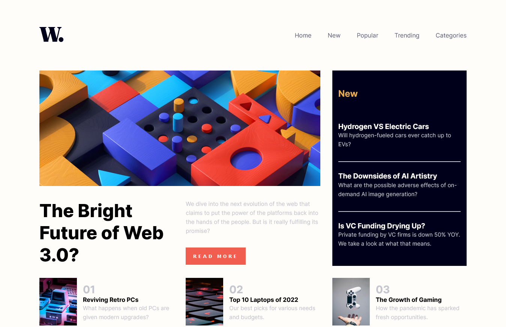
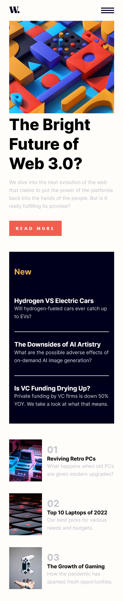

# Frontend Mentor - News homepage solution

This is a solution to the [News homepage challenge on Frontend Mentor](https://www.frontendmentor.io/challenges/news-homepage-H6SWTa1MFl). Frontend Mentor challenges help you improve your coding skills by building realistic projects.

## Table of contents

- [Overview](#overview)
  - [Screenshot](#screenshot)
  - [Links](#links)
  - [Built with](#built-with)
- [Author](#author)

## Overview

### Screenshot

### Links

- Solution URL: [@frontend mentor](https://www.frontendmentor.io/solutions/news-homepage-pure-html-and-css-j3nFukBuV4)
- Live Site URL: [@github pages](https://ragabogaa.github.io/news-homepage/)

### Built with

- Semantic HTML5 markup
- CSS custom properties
- Flexbox
- CSS Grid

## Author

- Website - [@github](https://github.com/RagaBoGaa)
- Frontend Mentor - [@ragaboga](https://www.frontendmentor.io/profile/RagaBoGaa)

